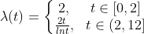
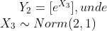
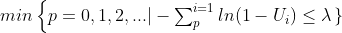
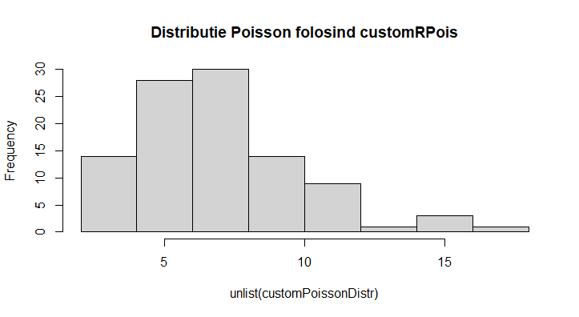
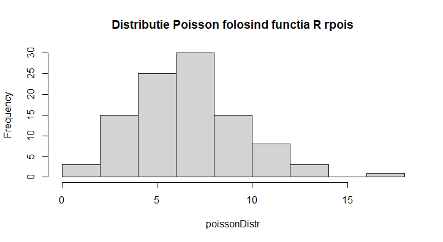
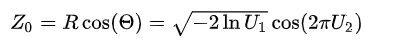
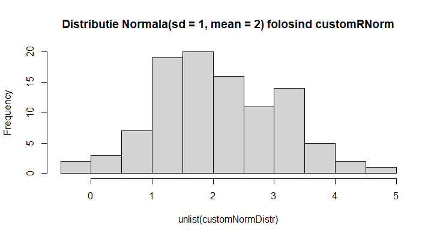

# Simularea unui atelier auto
Proiectul are ca scop simularea unui atelier auto care repara si curata masinile clientilor.

## Descrierea problemei
### Prezentare generala
Toti clientii atelierului trec prin acelasi proces: intai masina lor este reparata, apoi masina este spalata.  
Deci, sistemul de servire a clientilor poate fi privit ca un sistem de tip coada cu doua servere in serie, unde primul server are scopul de a repara masinile, iar al doilea server are scopul de a curata masinile. 
### Ipoteze 
- Atelierul este deschis 12 ore pe zi
- La finalul programului, atelierul nu mai accepta clienti noi in sistem
- Ambele servere sunt active pe intregul program si nu iau pauze
- Este de asteptat ca repararea unei masini sa dureze mai mult decat curatarea acesteia
- Majoritatea clientilor prefera sa vina dupa ce pleaca de la serviciu, deci atelierul se aglomereaza spre terminarea programului
- Clientii nou-veniti vor pleca daca sunt mai mult de 15 persoane in asteptare la primul server(cel ce se ocupa de reparatii)

### Obiective
- Determinarea Timpul minim, timpul mediu si timpul maxim petrecut de clienti in atelier
- Numarul mediu de clienti serviti intr-o zi
- Numarul mediu de clienti pierduti intr-o zi

## Datele problemei
### Sosirea clientilor
Clientii noi sosesc conform unui proces Poisson neomogen cu functia de intensitate  
  
  
  
### Timpul de servire
Timpurile de servire ale serverului 1 si serverului 2 sunt date de doua variabile aleatoare Y1, respectiv Y2. Cele doua variabile aleatoare au asociate urmatoarele functii de repartitie: 
   
  
  

## Simularea variabilelor aleatoare 
Inainte de a trece la implementarea efectiva a simularii atelierului, este necesara gasirea unui model teoretic pentru simularea variabilelor aleatoare de repartitii Poisson si normala. In acest scop, ne vom folosi doar de variabile aleatoare de repartitie uniforma.

### Simularea variabilei aleatoare de repartitie Poisson
Aceasta variabila aleatoare este necesara pentru determinarea timpului de servire al primului server.  

Pentru generarea acesteia, ne folosim de faptul ca o variabila aleatoare Poisson de parametru lambda este data de numarul de evenimente secventiale care au loc in timp lambda, unde perioadele temporale dintre evenimente sunt variabile aleatoare exponentiale de rata unitara.  
  
Matematic, acest lucru se transcrie astfel:  
  
 

Implementand modelul matematic in limbajul R, obtinem urmatoarea functie: 
```r
customRPois <- function(lambda) {
  p = 0
  mysum = 0
  while(1) {
    unif = runif(1)
    mysum = mysum + log(1 - unif)
    if(mysum * -1 >= lambda) {
      return(p)
    }
    p = p + 1
  }
}
```   
   
Generand 100 de observatii folosind `customRPois(lambda = 7.3)` si 100 de observatii folosind functia din R `rpois(lambda = 7.3)`, obtinem urmatoarele repartitii:  
   
  


De asemenea, analizand media si varianta, observam urmatoarele:  
| Functia folosita  | Media | Varianta|
| -------------     |:-----:| :-----:|
| `rpois`           | 7.17  | 8.44 |
| `customRPois`     | 7.5   | 8.47 |


### Simularea variabilei aleatoare de repartitie normala
Aceasta variabila aleatoare este necesara pentru determinarea timpului de servire al celui de al doilea server. 
  
Pentru generarea acesteia, ne folosim de algoritmul Box Muller. Cu ajutorul acesteia, putem simula o variabila aleatoare de repartie normala, cu media 0 si deviatia standard 1.

 

Implementarea corespunzatoare in limbajul R:
```r
customRNorm <- function(sd, mean) {
  U.1 <- runif(1)
  U.2 <- runif(1)
  theta <- 2*pi*U.1
  E <- -log(U.2)
  R <- sqrt(2*E)
  X <- R*cos(theta)
  return(sd*X + mean)
}
```

Pentru testare, generam 100 de observatii folosind `customRNorm` cu media 2 si deviatia standard 1 si 100 de observatii, cu aceeasi medie si varianta, folosind functia din R `rnorm`.

Rezultatele sunt:

  


| Functia folosita  | Media | Varianta|
| -------------     |:-----:| :-----:|
| `customRNorm`     | 2.08  | 1.01 |
| `rnorm`     | 2.07   | 0.91 |

## Rezultate obtinute

In continuare, sunt prezentate rezultatele obtinute in urma simularilor. 

### Timpul minim, timpul mediu si timpul maxim petrecut de clienti in sistem

Pentru determinarea acestori timpi, apelam intai functia `simulateOneDay()`. Aceasta intoarce urmatoarele date:
    - o lista cu timpii la care au sosit clientii noi in sistem
    - o lista cu timpii la care clientii au ajuns la serverul 2
    - o lista cu timpii la care clientii au iesit din sistem
    - o lista cu timpii la care au fost pierduti clienti

Rezultatul returnat il vom transmite functiei `waitingTimes(results)`, care va extrage timpii doriti. Obtinem urmatoarele rezultate:

|   | Timpul minim | Timpul mediu | Timpul maxim |
|---|:------------:|:------------:|:------------:|
| Sistem  | 0.35  | 2.26 |  3.87 |
| Server 1| 0.2  | 1.97 |  3.7 |
| Server 2| 0.05   | 0.29 |  1 |  

*<b>Observatie</b>: Timpii sunt exprimati in ore. Timpii pentru serverele 1 si 2 reprezinta suma dintre timpul de asteptare si servirea efectiva.*

### Numarul mediu de clienti serviti/pierduti intr-o zi

Folosind functia `avgClientsStats(noOfDays)`, putem calcula numarul mediu de clienti serviti(care ies din sistem) si numarul mediu de clienti pierduti intr-o zi.  
Functia simuleaza mai multe zile pentru indeplinirea acestui task.  
Vom selecta numarul de zile ca fiind 365.  
Rezultatul obtinut este:
| Nr mediu de clienti serviti/zi | Nr mediu de clienti pierduti/zi |
|:-----:| :-----:|
| 34.93  | 3.56 |  

*<b>Observatie</b>: Printr-o zi se intelege un program intreg de lucru, de 12 ore*
