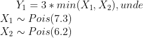

# Simularea unui atelier auto
Proiectul are ca scop simularea unui atelier auto care repara si curata masinile clientilor.

## Descrierea problemei
### Prezentare generala
Toti clientii atelierului trec prin acelasi proces: intai masina lor este reparata, apoi masina este spalata.  
Deci, sistemul de servire a clientilor poate fi privit ca un sistem de tip coada cu doua servere in serie, unde primul server are scopul de a repara masinile, iar al doilea server are scopul de a curata masinile. 
### Ipoteze 
- Atelierul este deschis 12 ore pe zi
- La finalul programului, atelierul nu mai accepta clienti noi in sistem
- Ambele servere sunt active pe intregul program si nu iau pauze
- Este de asteptat ca repararea unei masini sa dureze mai mult decat curatarea acesteia
- Majoritatea clientilor prefera sa vina dupa ce pleaca de la serviciu, deci atelierul se aglomereaza spre terminarea programului
- Clientii nou-veniti vor pleca daca sunt mai mult de 15 persoane in asteptare la primul server(cel ce se ocupa de reparatii)

## Datele problemei
### Sosirea clientilor
Clientii noi sosesc conform unui proces Poisson neomogen cu functia de intensitate  
  
  
  
### Timpul de servire
Timpurile de servire ale serverului 1 si serverului 2 sunt date de doua variabile aleatoare Y1, respectiv Y2. Cele doua variabile aleatoare au asociate urmatoarele functii de repartitie:  
  
  

## Simularea variabilelor aleatoare 
Inainte de a trece la implementarea efectiva a simularii atelierului, este necesara gasirea unui model teoretic pentru simularea variabilelor aleatoare de repartitii Poisson si Normala. In acest scop, ne vom folosi doar de variabile aleatoare de repartitie uniforma.

### Simularea variabilei aleatoare de repartiei Poisson
Aceasta variabila aleatoare este necesara pentru determinarea timpului de servire al primului server.  
